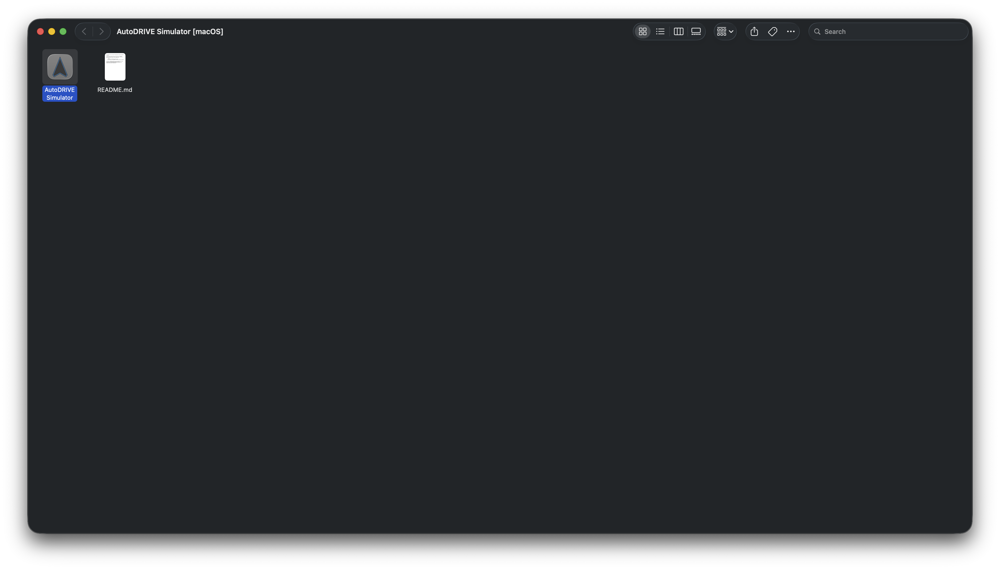
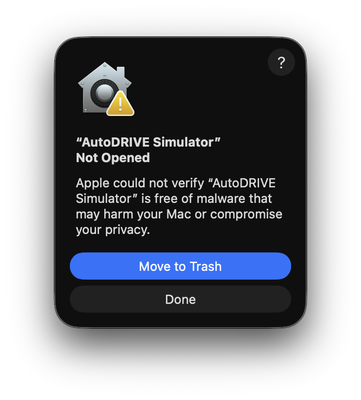
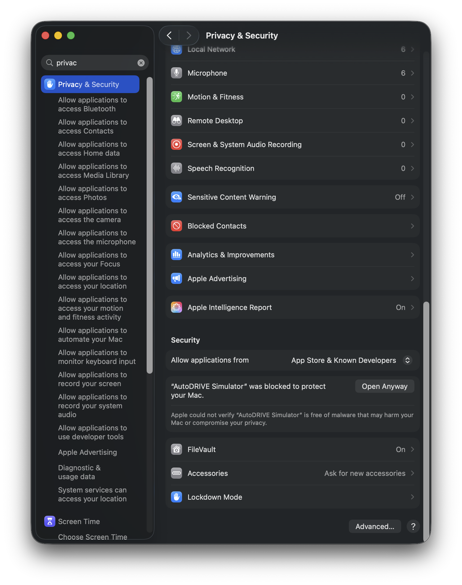
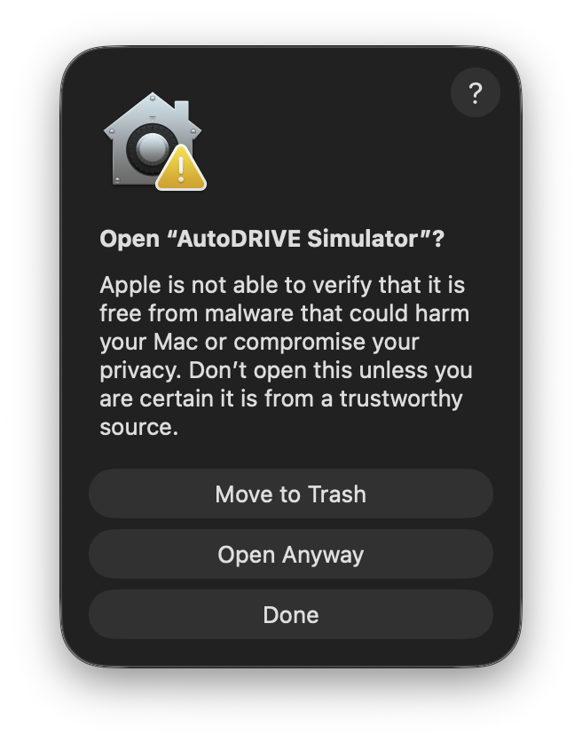
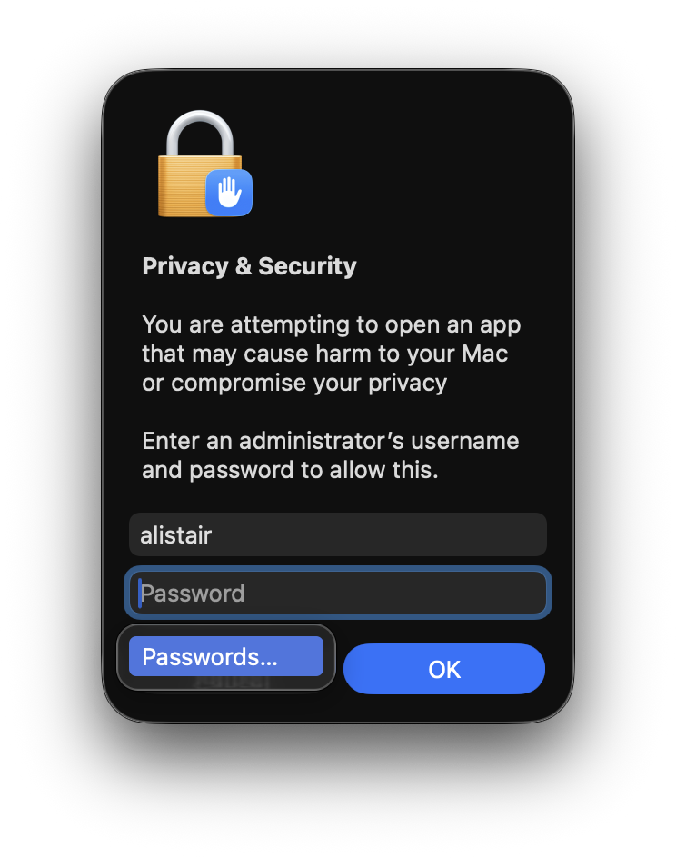

First, download the [AutoDRIVE Simulator](https://github.com/Tinker-Twins/AutoDRIVE/releases/download/Simulator-0.3.0/AutoDRIVE_Simulator_macOS.zip).

Then, open your downloads folder in your terminal. It should look like this:


Now run the following command to make it executable:

```bash
chmod +x AutoDRIVE\ Simulator\ \[macOS\]/AutoDRIVE\ Simulator.app/Contents/MacOS/AutoDRIVE\ Simulator
```

Now open the folder:

```bash
open AutoDRIVE\ Simulator\ \[macOS\]/
```

Now double click on the executable:



It will warn you that the file may be dangerous. That is just cuz Apple is picky about app certificates, and getting certified apps as an open source developer is painful and expensive ;-;. 



So click Done, and then open your system settings, and go to Privacy & Security, and you will see "AutoDRIVE Simulator" was blocked to protect your Mac:



Click "Open Anyway". It will show you a popup asking you to confirm:



Click "Open Anyway" again.



Now it will prompt you for your system password, enter it. Now AutoDRIVE will finally be running!

